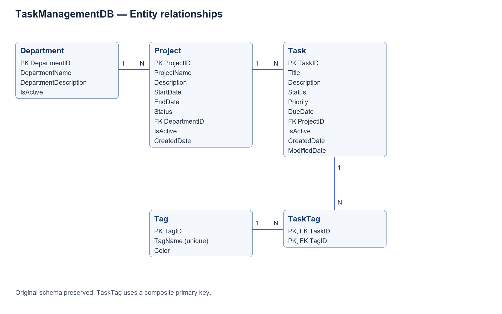

# TaskTrack backend

ASP.NET Core 8, PostgreSQL and EF Core Database First. The original five-table schema is preserved. Controllers delegate business rules to Services; Repositories own database access.

## Local configuration

Put a local connection string in `TaskTrack.API/appsettings.Development.json` under `ConnectionStrings:TaskManagement`. This file is ignored by Git. Never commit database credentials. Alternatively set `DATABASE_URL`.

Student: QE190017 · Class: SE19B.NET

Solution: `QE190017_SE19B.NET_Ass1_BE.sln`.

## Database diagram

## Implementation sequence

1. Scaffold solution and configuration.
2. Reverse engineer the existing database and implement repositories.
3. Implement validated public API and deletion rules.
4. Verify API integration and edge cases.
5. Add schema-preserving extensions and deployment documentation.

No automatic database creation, migrations or seed reset runs on application startup.

## Live deployment

- Frontend: https://asm-prn-232-fe.vercel.app
- Swagger: https://asm-prn232-be.onrender.com/swagger/index.html
- Readiness: https://asm-prn232-be.onrender.com/health/ready

Render Free PostgreSQL expires on October 29, 2026. Free web services sleep when idle and may need time to wake up.
