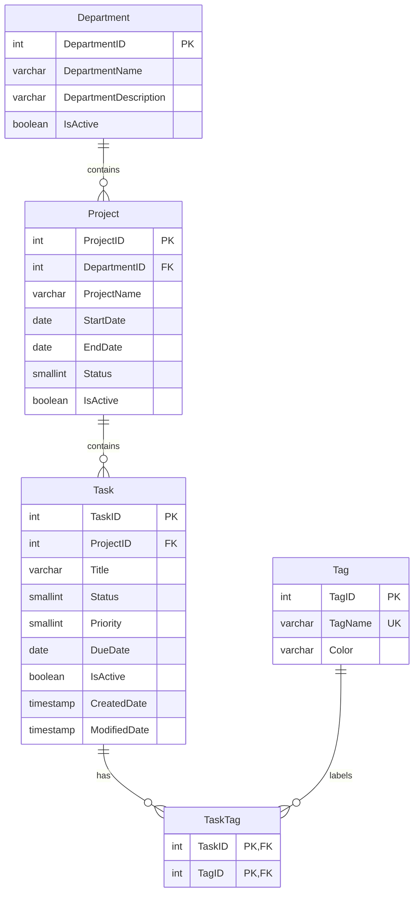

# Original database

```mermaid
erDiagram
    Department ||--o{ Project : contains
    Project ||--o{ Task : contains
    Task ||--o{ TaskTag : has
    Tag ||--o{ TaskTag : labels
    Department {
        int DepartmentID PK
        varchar DepartmentName
        varchar DepartmentDescription
        boolean IsActive
    }
    Project {
        int ProjectID PK
        int DepartmentID FK
        varchar ProjectName
        date StartDate
        date EndDate
        smallint Status
        boolean IsActive
    }
    Task {
        int TaskID PK
        int ProjectID FK
        varchar Title
        smallint Status
        smallint Priority
        date DueDate
        boolean IsActive
        timestamp CreatedDate
        timestamp ModifiedDate
    }
    Tag {
        int TagID PK
        varchar TagName UK
        varchar Color
    }
    TaskTag {
        int TaskID PK,FK
        int TagID PK,FK
    }
```
